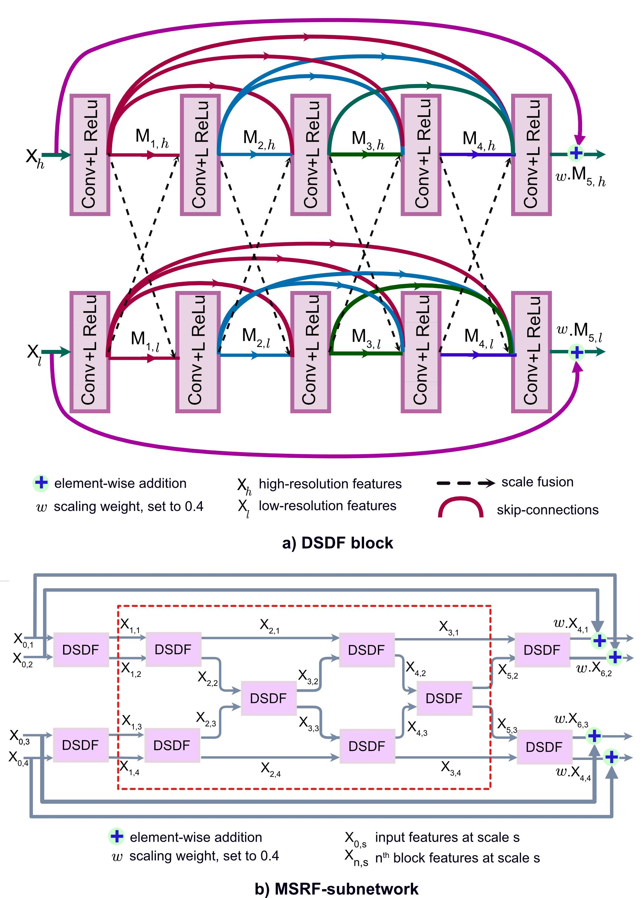
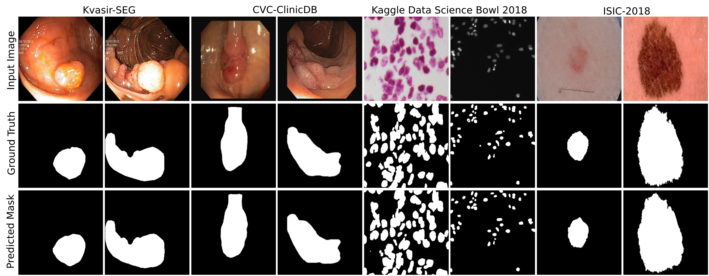

# MSRF-Net: A Multi-Scale Residual Fusion Network for Biomedical Image Segmentation
This repository provides code for our paper "MSRF-Net: A Multi-Scale Residual Fusion Network for Biomedical Image Segmentation" accepted for Publication at IEEE Journal of Biomedical and Health Informatics ([arxiv version](https://arxiv.org/abs/2105.07451))([ieeexplore version](https://ieeexplore.ieee.org/document/9662196%E2%80%A6))
## 2.) Overview
### 2.1.)Introduction

In   this   work,   we   propose   a   novel   medical   imagesegmentation  architecture,  calledMSRF-Net,  which  aims  toovercome  the  above  limitations.  Our  proposed  MSRF-Netmaintains  high-resolution  representation  throughout  the  pro-cess  which  is  conducive  to  potentially  achieving  high  spatialaccuracy.  The  MSRF-Net  utilizes  a  novel  dual-scale dense fusion (DSDF) block that performs dual scale feature exchangeand  a  sub-network  that  exchanges  multi-scale  features  usingthe  DSDF  block.  The  DSDF  block  takes  two  different  scaleinputs and employs a residual dense block that exchanges in-formation across different scales after each convolutional layerin  their  corresponding  dense  blocks.  The  densely  connectednature  of  blocks  allows  relevant  high-  and  low-level  featuresto be preserved for the final segmentation map prediction. Themulti-scale  information  exchange  in  our  network  preservesboth high- and low-resolution feature representations, therebyproducing  finer,  richer,  and  spatially  accurate  segmentationmaps. The repeated multi-scale fusion helps in enhancing thehigh-resolution  feature  representations  with  the  informationpropagated  by  low-resolution  representations.  Further,  layersof residual networks allow redundant DSDF blocks to die out,and only the most relevant extracted features contribute to thepredicted segmentation maps.
## 2.2.) DSDF Blocks and MSRF Sub-network

## 2.3.) Quantitative Results


## 3.) Training and Testing
## 3.1)Data Preparation
1.) make directory named "data/kdsb"

2.) make three sub-directories "train" "val" "test"

3.) Put images under directory named "images"

4.) Put masks under directory named "masks"

## 3.2)Training
Model architecture is defined in `model.py`
Run the script as:
`python train.py`

## 3.2)Testing
For testing the trained model run:
`python test.py`

## 4.) Citation
Please cite our paper if you find the work useful:

```
@article{srivastava2021msrf,
  title={MSRF-Net: A Multi-Scale Residual Fusion Network for Biomedical Image Segmentation},
  author={Srivastava, Abhishek and Jha, Debesh and Chanda, Sukalpa and Pal, Umapada and Johansen, H{\aa}vard D and Johansen, Dag and Riegler, Michael A and Ali, Sharib and Halvorsen, P{\aa}l},
  journal={arXiv preprint arXiv:2105.07451},
  year={2021}
}
```
## 5.) FAQ
Please feel free to contact me if you need any advice or guidance in using this work ([E-mail](abhisheksrivastava2397@gmail.com)) 


